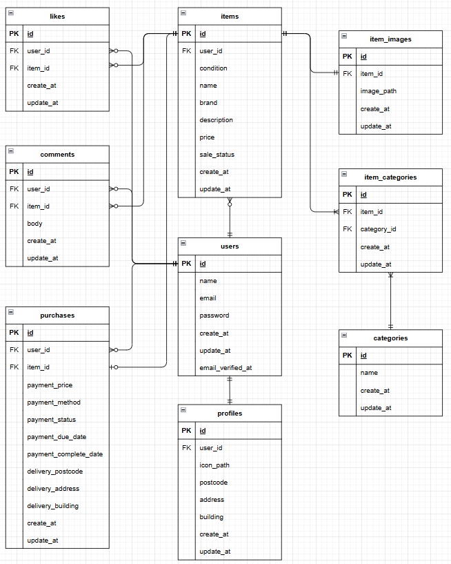

# coachtechフリマアプリ

### 概要
Coachtech課題として作成したフリマアプリです  
ユーザー登録、商品出品、商品購入、いいね、コメント機能を実装しています  
決済機能には **Stripe Checkout** を使用し、**クレジットカード決済 / コンビニ決済** に対応しています

## 環境構築手順

### Dockerビルド
1. リポジトリの取得 (このリポジトリをローカル環境に取得します)
- git clone https://github.com/firestone369/coachtech_furima.git
2. 取得したディレクトリに移動
- cd coachtech_furima
3. Dockerの起動
- docker compose up -d --build

### Laravel環境構築
4. PHPコンテナに入る
- docker compose exec php bash
5. パッケージのインストール
- composer install
6. .env設定

`.env` ファイルは `src/.env` に作成してください
`src/.env.example` をコピーして作成します
- cp src/.env.example src/.env

`APP_KEY` は以下のコマンドで生成してください
- php artisan key:generate

必要に応じて以下の項目を`.env`に設定してください。
- DB_DATABASE
- DB_USERNAME
- DB_PASSWORD
- STRIPE_KEY
- STRIPE_SECRET
- STRIPE_WEBHOOK_SECRET
7. データベース構築 (マイグレーションと初期データの投入)
- php artisan migrate --seed
8. ストレージリンク作成 （画像公開用のシンボリックリンクの作成）
- php artisan storage:link
9. Stripe CLIをインストール
- https://stripe.com/docs/stripe-cli
10. Stripe Webhook （Stripe CLIを使用してWebhookをローカル環境に転送)
- stripe listen --forward-to localhost/api/stripe/webhook

## 使用技術（実行環境）
- Laravel 8.x
- PHP 8.x
- MySQL 8.x
- Docker / Docker Compose
- Nginx 1.21.1
- Fortify (認証)
- MailHog (メールテスト)
- Stripe (決済)

## 決済機能
Stripe Checkout を利用しています

### 支払い方法
- カード支払い
- コンビニ支払い

### コンビニ支払いの流れ
1. Stripe Checkout でコンビニ決済を選択
2. 支払い番号をメール (MailHog) に送信
3. コンビニで支払い
4. 支払い完了後に購入確定
5. MailHogに届くメールから、「購入した商品一覧へ戻る」ボタンを押下
6. マイページの「購入した商品」画面へ遷移
- 未入金の場合は支払い期限後に自動キャンセル

### カード支払いの流れ
1. Stripe Checkout でカード支払いを選択
2. 支払い情報を入力後、「支払い」ボタンを押下
3. 支払い完了ページに遷移後、決済完了画面に遷移し、「購入商品一覧へ戻る」ボタンを押下
4. マイページの「購入した商品」画面へ遷移

## Scheduler （商品の支払い期限切れ処理）
期限切れの未決済購入は自動的にキャンセルされ、
商品は「売り切れ」から「販売中」に戻ります  
Docker起動時に scheduler コンテナが起動します  

## 認証機能

### MailHog 設定
- SMTP ポート: 1025
- MailHog: http://localhost:8025

### メール認証手順
1. 新規会員登録を行う
2. メール認証誘導画面に遷移
3. 「認証はこちらから」をクリック
4. ブラウザで http://localhost:8025 (MailHog) にアクセス
5. MailHogの受信メール一覧から認証メールを開く
6. メール内の認証URLをクリック
7. プロフィール設定画面へ遷移

## ER図

## URL
- アプリケーション： http://localhost/
- phpMyAdmin： http://localhost:8080
- MailHog: http://localhost:8025